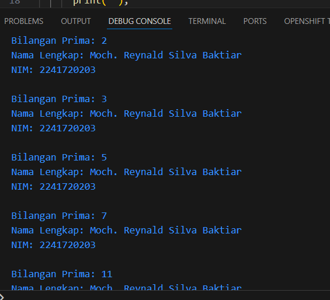

# 5. Tugas Praktikum
#### 1. Silakan selesaikan Praktikum 1 sampai 3, lalu dokumentasikan berupa screenshot hasil pekerjaan beserta penjelasannya!

#### Jawab : Sudah dilakukan pada proses sebelumnya

#### 2. Buatlah sebuah program yang dapat menampilkan bilangan prima dari angka 0 sampai 201 menggunakan Dart. Ketika bilangan prima ditemukan, maka tampilkan nama lengkap dan NIM Anda.

#### Jawab : Sudah dilakukan pada proses sebelumnya
```dart
void main() {
  String nama = "Moch. Reynald Silva Baktiar";
  String nim = "2241720203";

  bool isPrime(int number) {
    if (number <= 1) return false;
    for (int i = 2; i <= number ~/ 2; i++) {
      if (number % i == 0) return false;
    }
    return true; 
  }

  for (int i = 0; i <= 201; i++) {
    if (isPrime(i)) {
      print("Bilangan Prima: $i");
      print("Nama Lengkap: $nama");
      print("NIM: $nim");
      print("");
    }
  }
}
```

#### Output : 



#### 3. Kumpulkan berupa link commit repo GitHub pada tautan yang telah disediakan di grup Telegram!