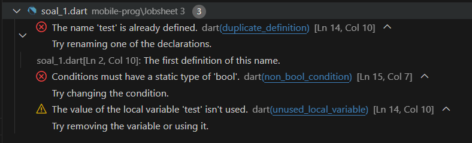
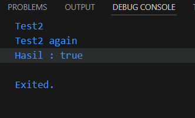

# 2. Praktikum 1: Menerapkan Control Flows ("if/else")
Selesaikan langkah-langkah praktikum berikut ini menggunakan DartPad di browser Anda.

## Langkah 1:
Ketik atau salin kode program berikut ke dalam fungsi main().

```dart
String test = "test2";
if (test == "test1") {
   print("Test1");
} else If (test == "test2") {
   print("Test2");
} Else {
   print("Something else");
}
if (test == "test2") print("Test2 again");
```

## Langkah 2:
#### Silakan coba eksekusi (Run) kode pada langkah 1 tersebut. Apa yang terjadi? Jelaskan!

#### Jawab : Output
```
Test2
Test2 again

Exited.
``` 
#### Kode diatas memeriksa variable String test apakah isi variabel test adalah "test2" jika iya maka menampilkan "Test2" dan menampilkan "Test2 again"

## Langkah 3:
Tambahkan kode program berikut, lalu coba eksekusi (Run) kode Anda.

```dart
String test = "true";
if (test) {
   print("Kebenaran");
}
```

### Apa yang terjadi ? Jika terjadi error, silakan perbaiki namun tetap menggunakan if/else.

#### Jawab : Terjadi error


#### Perbaikan kode :
#### Kode ini membandingkan variabel test dengan test2. Jika keduanya sama, variabel cek diubah menjadi true dan hasilnya dicetak. Jika tidak, cek tetap false.

```dart
void main() {
  String test = "test2";

  if (test == "test1") {
    print("Test1");
  } else if (test == "test2") {
    print("Test2");
  } else {
    print("Something else");
  }

  if (test == "test2") print("Test2 again");

  String test2 = "test2";
  bool cek = false;
  if (test == test2) {
    cek = true;
    print("Hasil : $cek");
  }
}
```
#### Hasil :



Equality checking and type coercion

Di JavaScript, pemeriksaan dua variable dapat menggunakan double "==" atau triple "===". Untuk double "==" hanya membandingkan nilainya saja, sedangkan triple "===" dibandingkan dengan tipe datanya. Contohnya dalam JavaScript, "7" == 7 akan bernilai true, tetapi "7" === 7 akan bernilai false. Ini bisa jadi sebuah bug jika Anda lupa dengan operator ini. Dart cukup menggunakan double "==" untuk membandingkan nilai sekaligus tipe datanya.

Berikut tambahan video materi terkait Conditional Expressions dan Switch-Case statements.