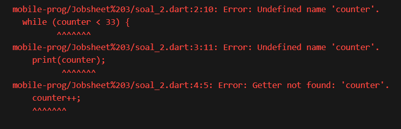

# 3. Praktikum 2: Menerapkan Perulangan "while" dan "do-while"
Selesaikan langkah-langkah praktikum berikut ini menggunakan DartPad di browser Anda.

## Langkah 1:
Ketik atau salin kode program berikut ke dalam fungsi main().
```dart
while (counter < 33) {
  print(counter);
  counter++;
}
```
## Langkah 2:
#### Silakan coba eksekusi (Run) kode pada langkah 1 tersebut. Apa yang terjadi? Jelaskan! Lalu perbaiki jika terjadi error.
#### Jawab : Terjadi error, seperti pada ganbar berikut. Error dikarenakan variabel counter tidak ada atau belum di deklarasikan sebelum melakukan looping


#### Perbaikan Kode : 
```dart
void main() {
  int counter = 0;
    while (counter < 33) {
      print(counter);
      counter++;
  }
}
```

## Langkah 3:
Tambahkan kode program berikut, lalu coba eksekusi (Run) kode Anda.
```dart
do {
  print(counter);
  counter++;
} while (counter < 77);
```


#### Apa yang terjadi ? Jika terjadi error, silakan perbaiki namun tetap menggunakan do-while.
#### Jawab : Error sama seperti sebelunya, namun jika diperbaiki dan di tambahkan dengan kode sebelumnya maka yang terjadi adalah seperti output dibawah ini, atau secara singkat bahwa looping do-while melakukan print() dahulu lalu dilakukan pengecekan


