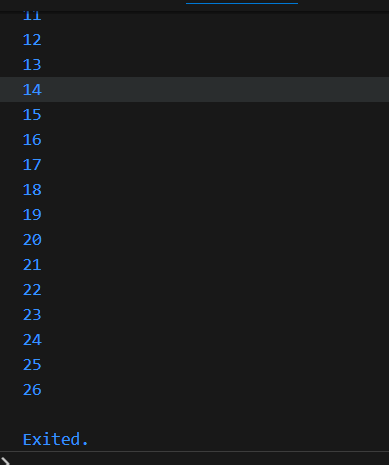

# 4. Praktikum 3: Menerapkan Perulangan "for" dan "break-continue"
Selesaikan langkah-langkah praktikum berikut ini menggunakan DartPad di browser Anda.

## Langkah 1:
Ketik atau salin kode program berikut ke dalam fungsi main().
```dart
for (Index = 10; index < 27; index) {
  print(Index);
}
```
## Langkah 2:
#### Silakan coba eksekusi (Run) kode pada langkah 1 tersebut. Apa yang terjadi? Jelaskan! Lalu perbaiki jika terjadi error.

#### Jawab : Terjadi error, yaitu variabel index belum dideklarasikan, tidak ada iterasi (nilai pengubah) sehingga terjadi infinity loop

#### Perbaikan Kode :
```dart

void main() {
  int index;
    for (index = 10; index < 27; index++) {
      print(index);
    }
}
```



## Langkah 3:
Tambahkan kode program berikut di dalam for-loop, lalu coba eksekusi (Run) kode Anda.
```dart
If (Index == 21) break;
Else If (index > 1 || index < 7) continue;
print(index);
```
#### Apa yang terjadi ? Jika terjadi error, silakan perbaiki namun tetap menggunakan for dan break-continue.
#### Jawab : Terjadi Error, namun setelah perbaikan kode seperti dibawah ini maka akan memberikan contoh penggunaan break dan continue

```dart
void main() {
  int index;
    for (index = 10; index < 27; index++) {
        print(index);
        if (index == 21) break;
        else if (index > 1 || index < 7) continue;
        print(index);
    }
}
```
