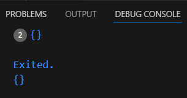

# Praktikum 2: Eksperimen Tipe Data Set
Selesaikan langkah-langkah praktikum berikut ini menggunakan VS Code atau Code Editor favorit Anda.

#### Langkah 1:
Ketik atau salin kode program berikut ke dalam ```void main()```.

```dart
var halogens = {'fluorine', 'chlorine', 'bromine', 'iodine', 'astatine'};
print(halogens);
```
#### Langkah 2:
Silakan coba eksekusi (Run) kode pada langkah 1 tersebut. Apa yang terjadi? Jelaskan! Lalu perbaiki jika terjadi error.


**Jawab** :Kode Dart ini akan membuat sebuah set bernama halogens yang berisi elemen-elemen yaitu 
```dart
'fluorine', 'chlorine', 'bromine', 'iodine', 'astatine'
```
Karena set tidak memiliki urutan, elemen-elemen dalam output mungkin muncul dalam urutan yang berbeda setiap kali program dijalankan, tetapi semua elemen yang ada tetap sama.

#### Langkah 3:
Tambahkan kode program berikut, lalu coba eksekusi (Run) kode Anda.
```dart
var names1 = <String>{};
Set<String> names2 = {}; // This works, too.
var names3 = {}; // Creates a map, not a set.

print(names1);
print(names2);
print(names3);
```
Apa yang terjadi ? Jika terjadi error, silakan perbaiki namun tetap menggunakan ketiga variabel tersebut. Tambahkan elemen nama dan NIM Anda pada kedua variabel Set tersebut dengan dua fungsi berbeda yaitu ```.add()``` dan ```.addAll()```. Untuk variabel Map dihapus, nanti kita coba di praktikum selanjutnya.

Dokumentasikan code dan hasil di console, lalu buat laporannya.

**Jawab :** Kode menampilkan Array kosong seperti dalam console dibawah ini



setelah mendapat perbaikan kode yang akan dihasilkan sebagai berikut
**Kode :**
```dart
void main() {
  var names1 = <String>{};
  Set<String> names2 = {}; 

  names1.add('Moch Reynald Silva Baktiar');
  names1.add('2241720203');

  names2.addAll({'Annisa Putri Purnomo', '224172212'});

  print(names1);
  print(names2);
}
```
Dalam kode ini, dua set dibuat untuk menyimpan nama dan NIM. Set pertama ```(names1)``` diisi dengan metode ```.add()```, sedangkan set kedua ```(names2)``` diisi dengan metode ```.addAll()```.


