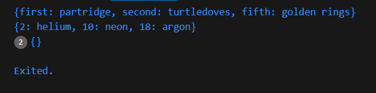

# Praktikum 3: Eksperimen Tipe Data Maps
Selesaikan langkah-langkah praktikum berikut ini menggunakan VS Code atau Code Editor favorit Anda.

#### Langkah 1:
Ketik atau salin kode program berikut ke dalam ```void main()```.

```dart
var gifts = {
  // Key:    Value
  'first': 'partridge',
  'second': 'turtledoves',
  'fifth': 1
};

var nobleGases = {
  2: 'helium',
  10: 'neon',
  18: 2,
};

print(gifts);
print(nobleGases);
```
#### Langkah 2:
Silakan coba eksekusi (Run) kode pada langkah 1 tersebut. Apa yang terjadi? Jelaskan! Lalu perbaiki jika terjadi error.


**Jawab** : Kode Dart ini membuat dua map: ``gifts`` dengan hadiah dan ``nobleGases`` dengan nomor golongan gas mulia. Saat dieksekusi, output yang dicetak adalah:

```dart
{first: partridge, second: turtledoves, fifth: 1}
{2: helium, 10: neon, 18: 2}
```
Kedua map dicetak tanpa kesalahan.

#### Langkah 3:
Tambahkan kode program berikut, lalu coba eksekusi (Run) kode Anda.
```dart
var mhs1 = Map<String, String>();
gifts['first'] = 'partridge';
gifts['second'] = 'turtledoves';
gifts['fifth'] = 'golden rings';

var mhs2 = Map<int, String>();
nobleGases[2] = 'helium';
nobleGases[10] = 'neon';
nobleGases[18] = 'argon';
```
Apa yang terjadi ? Jika terjadi error, silakan perbaiki.

Tambahkan elemen nama dan NIM Anda pada tiap variabel di atas (``gifts``, ``nobleGases``, ``mhs1``, dan ``mhs2``). Dokumentasikan hasilnya dan buat laporannya!

Dokumentasikan code dan hasil di console, lalu buat laporannya.

**Jawab :** Kode menampilkan tidak menampilkan hasil dari tambahan kode, seperti dalam console dibawah ini



setelah mendapat perbaikan kode yang akan dihasilkan sebagai berikut
**Kode :**
```dart
void main() {
  var gifts = {
    // Key:    Value
    'first': 'partridge',
    'second': 'turtledoves',
    'fifth': 'golden rings', // Ganti dari integer menjadi string
  };

  var nobleGases = {
    2: 'helium',
    10: 'neon',
    18: 'argon', // Pastikan semua nilai bertipe String
  };

  print(gifts);
  print(nobleGases);

  var mhs1 = Map<String, String>();
  mhs1['first'] = 'partridge';
  mhs1['second'] = 'turtledoves';
  mhs1['fifth'] = 'golden rings';

  var mhs2 = Map<int, String>();
  mhs2[2] = 'helium';
  mhs2[10] = 'neon';
  mhs2[18] = 'argon';

  print(mhs1);
  print(mhs2);
}
```
``mhs1`` adalah Map dengan kunci dan nilai bertipe string, diisi dengan pasangan kunci-nilai seperti ``'first': 'partridge'``, ``'second': 'turtledoves'``, dan ``'fifth': 'golden rings'``. Sedangkan ``mhs2`` adalah Map dengan kunci bertipe integer dan nilai bertipe ``string``, diisi dengan kunci 2 sebagai ``'helium'``, 10 sebagai ``'neon'``, dan 18 sebagai ``'argon'``. Keduanya menyimpan data terstruktur dan dapat diakses menggunakan kunci masing-masing.


