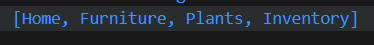

## Praktikum 4: Eksperimen Tipe Data List: Spread dan Control-flow Operators

Selesaikan langkah-langkah praktikum berikut ini menggunakan VS Code atau Code Editor favorit Anda.

#### Langkah 1:
Ketik atau salin kode program berikut ke dalam fungsi main().
```dart
var list = [1, 2, 3];
var list2 = [0, ...list];
print(list);
print(list2);
print(list2.length);
```
#### Langkah 2:
Silakan coba eksekusi (Run) kode pada langkah 1 tersebut. Apa yang terjadi? Jelaskan! Lalu perbaiki jika terjadi error.

**Jawab :** 

Kode tersebut mendeklarasikan dua list: ``list`` berisi ``[1, 2, 3]``, dan ``list2`` menggunakan spread operator untuk menggabungkan 0 dengan elemen-elemen dari ``list``, sehingga ``list2`` menjadi ``[0, 1, 2, 3]``. Ketika dicetak, ``list`` menunjukkan isi aslinya, sedangkan ``list2`` menunjukkan elemen tambahan. Panjang ``list2`` adalah 4, mendefinisikan jumlah total elemen setelah penambahan.

#### Langkah 3:
Tambahkan kode program berikut, lalu coba eksekusi (Run) kode Anda.
```dart
list1 = [1, 2, null];
print(list1);
var list3 = [0, ...?list1];
print(list3.length);
```
Apa yang terjadi ? Jika terjadi error, silakan perbaiki.

Tambahkan variabel list berisi NIM Anda menggunakan Spread Operators. Dokumentasikan hasilnya dan buat laporannya!

**Jawab :** 

Output yang dihasilkan adalah ``[1, 2, 3]``, ``[0, 1, 2, 3]``, dan ``4`` karena pada ``list1`` yang didefinisikan sebagai ``[1, 2, null]``, ketika dicetak, hasilnya adalah ``[1, 2, null]``. Namun, saat menggunakan *null-aware* spread operator ``...?`` pada ``list3``, elemen *null* tidak dimasukkan, sehingga ``list3`` menjadi ``[0, 1, 2]``. Akibatnya, panjang ``list3`` adalah ``3``, karena hanya terdapat tiga elemen: ``0``, ``1``, dan ``2``.


Output dan Kode setelah ditambahkan NIM saya,
```dart
void main() {
  var list = [1, 2, 3];
  var list2 = [0, ...list];
  print(list);
  print(list2);
  print(list2.length);

  print("Tambahan Kode :");
  var list1 = [1, 2, null];
  print(list1);
  var list3 = [0, ...?list1];
  print(list3.length);  


  print("Tambahkan NIM :");
  var nim = ['2241720203', '224123456', '224112234'];
  var listNim = [...nim];
  print(listNim);
}
```


#### Langkah 4:
Tambahkan kode program berikut, lalu coba eksekusi (Run) kode Anda.
```dart
var nav = ['Home', 'Furniture', 'Plants', if (promoActive) 'Outlet'];
print(nav);
```
Apa yang terjadi ? Jika terjadi error, silakan perbaiki. Tunjukkan hasilnya jika variabel promoActive ketika true dan false.

**Jawab :** Terjadi Error karena ``promoActive`` tidak terdefinisi, maka berikut adalah perbaikan kode
```dart
  var promoActive = true;
  var nav = ['Home', 'Furniture', 'Plants', if (promoActive) 'Outlet'];
  print(nav);
```
**Output :**


#### Langkah 5:
Tambahkan kode program berikut, lalu coba eksekusi (Run) kode Anda.
```dart
var nav2 = ['Home', 'Furniture', 'Plants', if (login case 'Manager') 'Inventory'];
print(nav2);
```
Apa yang terjadi ? Jika terjadi error, silakan perbaiki. Tunjukkan hasilnya jika variabel login mempunyai kondisi lain.

**Jawab :** Terjadi Error karena ``case`` untuk ``'Manager'`` belum di definisikan, maka berikut adalah perbaikan kode nya

```dart
var login = 'Manager';
var nav2 = ['Home', 'Furniture', 'Plants', if (login case 'Manager') 'Inventory'];
print(nav2);
```


Lalu apabila dengan kondisi lain,
```dart
var login = 'User'; //rubah jika akan menggunakan kondisi lain
var nav2 = [
    'Home',
    'Furniture',
    'Plants',
    if (login == 'Manager') 'Inventory',
    if (login == 'Admin') 'Settings',
    if (login == 'User') 'Profile'
];
print(nav2);
```
**Output :**


#### Langkah 6:
Tambahkan kode program berikut, lalu coba eksekusi (Run) kode Anda.
```dart
var listOfInts = [1, 2, 3];
var listOfStrings = ['#0', for (var i in listOfInts) '#$i'];
assert(listOfStrings[1] == '#1');
print(listOfStrings);
```
Apa yang terjadi ? Jika terjadi error, silakan perbaiki. Jelaskan manfaat Collection For dan dokumentasikan hasilnya

**Jawab :** Kodenya berhasil membuat daftar ``string`` ``['#0', '#1', '#2', '#3']`` dari daftar ``integer`` ``listOfInts``. Dengan menggunakan Collection For, kita dapat mengiterasi setiap elemen listOfInts dan mengubahnya menjadi string dengan format ``#$i``, yang ditambahkan ke dalam ``listOfStrings``. Manfaat Collection For mencakup peningkatan keterbacaan dan efisiensi kode, serta fleksibilitas dalam memanipulasi elemen saat pembuatan daftar.


