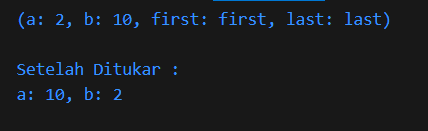
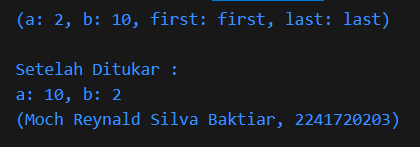
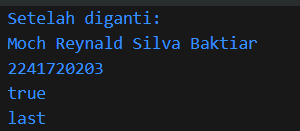

## Praktikum 5: Eksperimen Tipe Data Records

Selesaikan langkah-langkah praktikum berikut ini menggunakan VS Code atau Code Editor favorit Anda.

#### Langkah 1:
Ketik atau salin kode program berikut ke dalam fungsi ```main()```.
```dart
var record = ('first', a: 2, b: true, 'last');
print(record);
```


#### Langkah 2:
Silakan coba eksekusi (Run) kode pada langkah 1 tersebut. Apa yang terjadi? Jelaskan! Lalu perbaiki jika terjadi error.

**Jawab :** Kode ini membuat sebuah record yang bisa menyimpan berbagai jenis data, yaitu ``boolean``, ``int``, dan ``string``  

#### Langkah 3:
Tambahkan kode program berikut di luar scope void main(), lalu coba eksekusi (Run) kode Anda.
```dart
(int, int) tukar((int, int) record) {
  var (a, b) = record;
  return (b, a);
}
```
Apa yang terjadi ? Jika terjadi error, silakan perbaiki. Gunakan fungsi tukar() di dalam main() sehingga tampak jelas proses pertukaran value field di dalam Records.
**Jawab :** Terjadi proses untuk menukar isi nilai dari ``record`` ``a`` dan ``record`` ``b`` namun terjadi error karena ``record`` ``b`` adalah ``boolean`` sehingga diperlukan beberapa penyesuaian. Berikut adalah kode dan outputnya

**Kode :**
```dart
void main() {
  var record = (first: 'first', a: 2, b: 10, last: 'last');
  print(record);
  
  var menukar = tukar((record.a, record.b));
  
  record = (first: record.first, a: menukar.$1, b: menukar.$2, last: record.last);
  
  print("\nSetelah Ditukar : \na: ${record.a}, b: ${record.b}");
}

(int, int) tukar((int, int) record) {
  var (a, b) = record;
  return (b, a);
}
```
**Output :**


#### Langkah 4:
Tambahkan kode program berikut di dalam scope void main(), lalu coba eksekusi (Run) kode Anda.
```dart
// Record type annotation in a variable declaration:
(String, int) mahasiswa;
print(mahasiswa);
```
Apa yang terjadi ? Jika terjadi error, silakan perbaiki. Inisialisasi field nama dan NIM Anda pada variabel record mahasiswa di atas. Dokumentasikan hasilnya dan buat laporannya!

**Jawab :** Terjadi Error, Karena nama dan NIM belum di isikan atau di inisialisasikan, sehingga perubahan kode sebagai berikut, 
```dart
 (String, int) mahasiswa = ('Moch Reynald Silva Baktiar', 2241720203);
 print(mahasiswa);
```



#### Langkah 5:
Tambahkan kode program berikut di dalam scope void main(), lalu coba eksekusi (Run) kode Anda.
```dart
var mahasiswa2 = ('first', a: 2, b: true, 'last');

print(mahasiswa2.$1); // Prints 'first'
print(mahasiswa2.a); // Prints 2
print(mahasiswa2.b); // Prints true
print(mahasiswa2.$2); // Prints 'last'
```
Apa yang terjadi ? Jika terjadi error, silakan perbaiki. Gantilah salah satu isi record dengan nama dan NIM Anda, lalu dokumentasikan hasilnya dan buat laporannya!

**Jawab :** Terjadi pembuatan record baru dengan nama variabel record ``mahasiswa2`` 
```dart
mahasiswa2 = ('Moch Reynald Silva Baktiar', a: 2241720203, b: true, 'last');
print("\nSetelah diganti: ");
print(mahasiswa2.$1);
print(mahasiswa2.a); 
print(mahasiswa2.b);
print(mahasiswa2.$2); 
```


