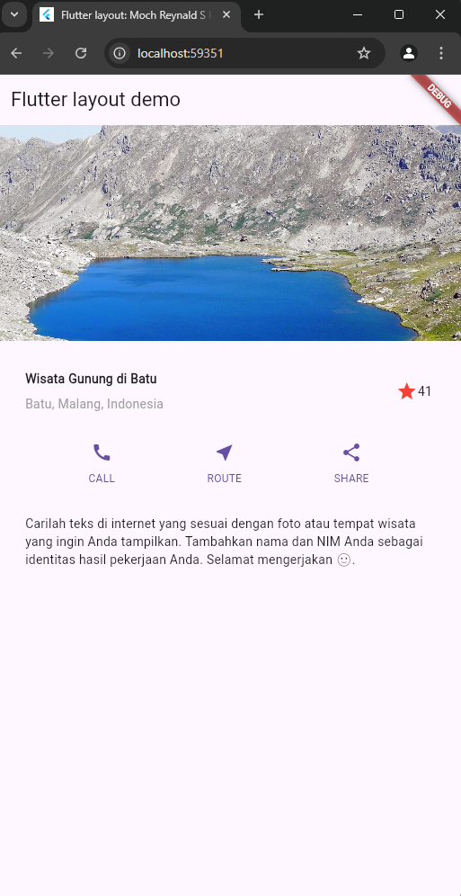

# 6. Praktikum 4: Implementasi image section
Selesaikan langkah-langkah praktikum berikut ini dengan melanjutkan dari praktikum sebelumnya.

### Langkah 1: Siapkan aset gambar
Anda dapat mencari gambar di internet yang ingin ditampilkan. Buatlah folder images di root project `layout_flutter`. Masukkan file gambar tersebut ke folder images, lalu set nama file tersebut ke file `pubspec.yaml` seperti berikut:


Contoh nama file gambar di atas adalah `lake.png`

> [!TIP] 
> <li>Perhatikan bahwa pubspec.yaml sensitif terhadap huruf besar-kecil, jadi tulis assets: dan URL gambar seperti yang ditunjukkan di atas.
> <li> File pubspec juga sensitif terhadap spasi, jadi gunakan indentasi yang tepat.
> <li> Anda mungkin perlu memulai ulang program yang sedang berjalan (baik di simulator atau perangkat yang terhubung) agar perubahan pubspec dapat diterapkan.</li>

### Langkah 2: Tambahkan gambar ke body
Tambahkan aset gambar ke dalam body seperti berikut:


BoxFit.cover memberi tahu kerangka kerja bahwa gambar harus sekecil mungkin tetapi menutupi seluruh kotak rendernya.

### Langkah 3: Terakhir, ubah menjadi ListView
Pada langkah terakhir ini, atur semua elemen dalam ListView, bukan Column, karena ListView mendukung scroll yang dinamis saat aplikasi dijalankan pada perangkat yang resolusinya lebih kecil.


#### Hasil : 
##### Full Code : 
```dart
import 'package:flutter/material.dart';

void main() => runApp(const MyApp());

class MyApp extends StatelessWidget {
  const MyApp({super.key});

  @override
  Widget build(BuildContext context) {
    Color color = Theme.of(context).primaryColor;

    Widget buttonSection = Row(
      mainAxisAlignment: MainAxisAlignment.spaceEvenly,
      children: [
        _buildButtonColumn(color, Icons.call, 'CALL'),
        _buildButtonColumn(color, Icons.near_me, 'ROUTE'),
        _buildButtonColumn(color, Icons.share, 'SHARE'),
      ],
    );
    // Define the title section with padding, row, and required layout
    Widget titleSection = Container(
      padding: const EdgeInsets.all(32), // Padding around the title section
      child: Row(
        children: [
          Expanded(
            /* soal 1: Column inside Expanded widget */
            child: Column(
              crossAxisAlignment:
                  CrossAxisAlignment.start, // Align start of row
              children: [
                /* soal 2: Text with padding and bold font */
                Container(
                  padding: const EdgeInsets.only(bottom: 8), // Bottom padding
                  child: const Text(
                    'Wisata Gunung di Batu', // First text line
                    style: TextStyle(
                      fontWeight: FontWeight.bold,
                    ),
                  ),
                ),
                const Text(
                  'Batu, Malang, Indonesia', // Second text line
                  style: TextStyle(
                    color: Colors.grey, // Set text color to grey
                  ),
                ),
              ],
            ),
          ),
          /* soal 3: Icon and text for rating */
          Icon(
            Icons.star, // Star icon
            color: Colors.red, // Red color for the star icon
          ),
          const Text('41'), // Text showing rating "41"
        ],
      ),
    );
    Widget textSection = Container(
      padding: const EdgeInsets.all(32),
      child: const Text(
        'Carilah teks di internet yang sesuai '
        'dengan foto atau tempat wisata yang ingin '
        'Anda tampilkan. '
        'Tambahkan nama dan NIM Anda sebagai '
        'identitas hasil pekerjaan Anda. '
        'Selamat mengerjakan 🙂.',
        softWrap: true,
      ),
    );

    return MaterialApp(
      title: 'Flutter layout: Moch Reynald S B dan 2241720203',
      home: Scaffold(
        appBar: AppBar(
          title: const Text('Flutter layout demo'),
        ),
        body: ListView(
          children: [
            Image.asset(
              'images/lake.png',
              width: 600,
              height: 240,
              fit: BoxFit.cover,
            ),
            titleSection,
            buttonSection,
            textSection
            // Replace 'Hello World' with the titleSection widget
          ],
        ),
      ),
    );
  }

  Column _buildButtonColumn(Color color, IconData icon, String label) {
    return Column(
      mainAxisSize: MainAxisSize.min,
      mainAxisAlignment: MainAxisAlignment.center,
      children: [
        Icon(icon, color: color),
        Container(
          margin: const EdgeInsets.only(top: 8),
          child: Text(
            label,
            style: TextStyle(
              fontSize: 12,
              fontWeight: FontWeight.w400,
              color: color,
            ),
          ),
        ),
      ],
    );
  }
}
```
##### Output : 

