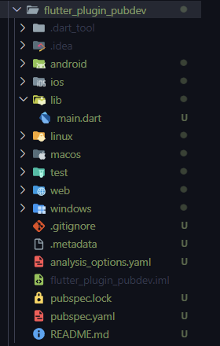
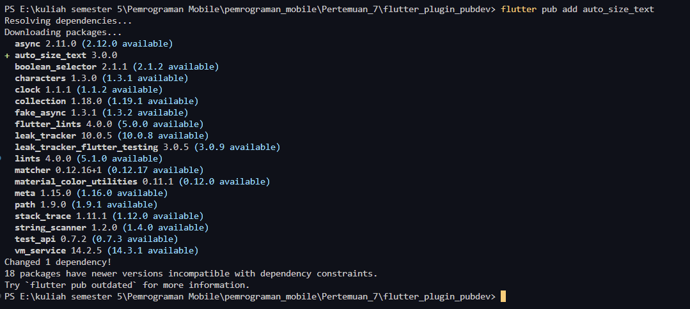
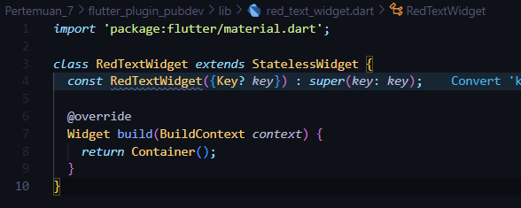
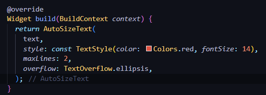
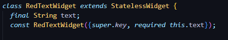
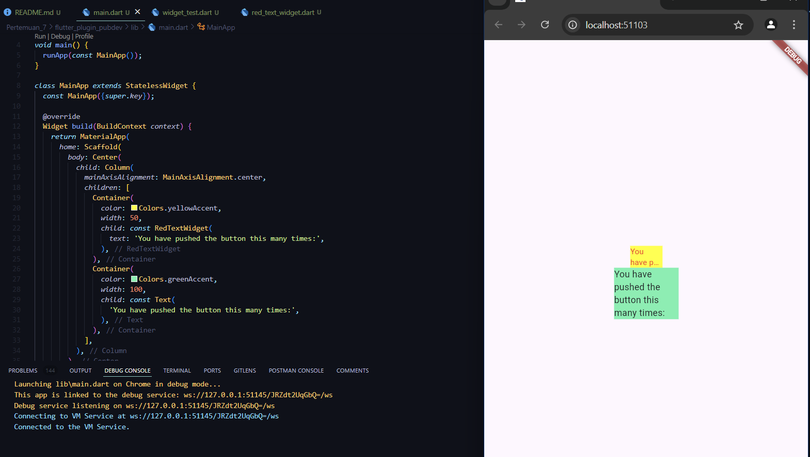

 

## Praktikum 

### Langkah 1: Buat Project Baru
membuat project baru dengan nama flutter_plugin_pubdev

### Langkah 2: Menambahkan Plugin
Menambahkan plugin auto_size_text

Jika berhasil, maka akan tampil nama plugin beserta versinya di file pubspec.yaml pada bagian dependencies.

### Langkah 3: Buat file `red_text_widget.dart
Membuat file red_text_widget.dart di dalam folder lib

### Langkah 4: Tambah Widget AutoSizeText
Menambahkan widget AutoSizeText di dalam file red_text_widget.dart

### Langkah 5: Buat Variable Text dan parameter di constructor
Menambahkan variable text dan parameter di constructor di dalam file red_text_widget.dart

### Langkah 6: Menambahkan widget di main.dart
Menambahkan widget RedTextWidget di dalam file main.dart

## Tugas
1. Selesaikan Praktikum tersebut, lalu dokumentasikan dan push ke repository Anda berupa screenshot hasil pekerjaan beserta penjelasannya di file README.md!
2. Jelaskan maksud dari langkah 2 pada praktikum tersebut! 
jawab :  
Menambahkan plugin auto_size_text bertujuan untuk menambahkan fitur auto size text pada aplikasi flutter yang sedang dibuat.
3. Jelaskan maksud dari langkah 5 pada praktikum tersebut! 
jawab : 
Membuat file red_text_widget.dart bertujuan untuk membuat widget baru yang berisi text dengan warna merah.
4. Pada langkah 6 terdapat dua widget yang ditambahkan, jelaskan fungsi dan perbedaannya! 
jawab : 
Pada langkah 6 terdapat dua widget yang ditambahkan, yaitu Text dan RedTextWidget. Keduanya memiliki fungsi yang sama untuk menampilkan text. RedTextWidget Menampilkan text berwarna merah dan menerapkan auto size text agar sesuai dengan ukuran Container, sedangkan Text menampilkan text secara utuh tanpa melakukan manipulasi size font pada text.
5. Jelaskan maksud dari tiap parameter yang ada di dalam plugin auto_size_text berdasarkan tautan pada dokumentasi ini ! 
jawab : 
Berikut penjelasan tiap parameter di plugin `auto_size_text`

<table>
    <thead>
        <tr>
            <td>Parameter</td>
            <td>Deskripsi</td>
        </tr>
    </thead>
    <tbody>
        <tr>
            <td>key</td>
            <td>Mengontrol bagaimana satu widget menggantikan widget lain di tree.</td>
        </tr>
        <tr>
            <td>textKey</td>
            <td>Mengatur kunci untuk widget Teks yang dihasilkan.</td>
        </tr>
        <tr>
            <td>style</td>
            <td>Melakukan manipulasi pada text.</td>
        </tr>
        <tr>
            <td>minFontSize</td>
            <td>Batasan ukuran teks minimum yang akan digunakan saat mengubah ukuran teks secara otomatis. Diabaikan jika presetFontSizes diatur.</td>
        </tr>
        <tr>
            <td>maxFontSize</td>
            <td>The maximum text size constraint to be used when auto-sizing text. Is being ignored if presetFontSizes is set.</td>
        </tr>
        <tr>
            <td>stepGranularity</td>
            <td>The step size in which the font size is being adapted to constraints.</td>
        </tr>
        <tr>
            <td>presetFontSizes</td>
            <td>Mendefinisikan semua ukuran font yang mungkin. Penting: presetFontSizes harus dalam urutan menurun.</td>
        </tr>
        <tr>
            <td>group</td>
            <td>Menyinkronkan ukuran beberapa AutoSizeText</td>
        </tr>
        <tr>
            <td>textAlign</td>
            <td>Bagaimana teks harus disejajarkan secara horizontal.</td>
        </tr>
        <tr>
            <td>textDirection</td>
            <td>Arah teks. Ini menentukan bagaimana nilai textAlign seperti TextAlign.start dan TextAlign.end.</td>
        </tr>
        <tr>
            <td>locale</td>
            <td>Digunakan untuk memilih font ketika karakter Unicode yang sama dapat dirender secara berbeda, tergantung pada lokasi.</td>
        </tr>
        <tr>
            <td>softWrap</td>
            <td>Apakah teks harus berhenti pada jeda baris sesuai ukuran Widget yang menampung.</td>
        </tr>
        <tr>
            <td>wrapWords</td>
            <td>Apakah kata-kata yang tidak muat dalam satu baris harus dibungkus. Defaultnya adalah true.</td>
        </tr>
        <tr>
            <td>overflow</td>
            <td>Bagaimana overflow harus ditangani.</td>
        </tr>
        <tr>
            <td>overflow</td>
            <td>Untuk menangani overflow.</td>
        </tr>
        <tr>
            <td>overflowReplacement</td>
            <td>Jika teks meluap dan tidak sesuai dengan batasnya, widget ini akan ditampilkan.</td>
        </tr>
        <tr>
            <td>textScaleFactor</td>
            <td>Jumlah piksel font untuk setiap piksel. Juga memengaruhi minFontSize, maxFontSize, dan presetFontSizes.</td>
        </tr>
        <tr>
            <td>maxLines</td>
            <td>Jumlah maksimal baris yang di buat.</td>
        </tr>
        <tr>
            <td>semanticsLabel</td>
            <td>Membuat label semantic pada teks ini.</td>
        </tr>
    </tbody>
</table>